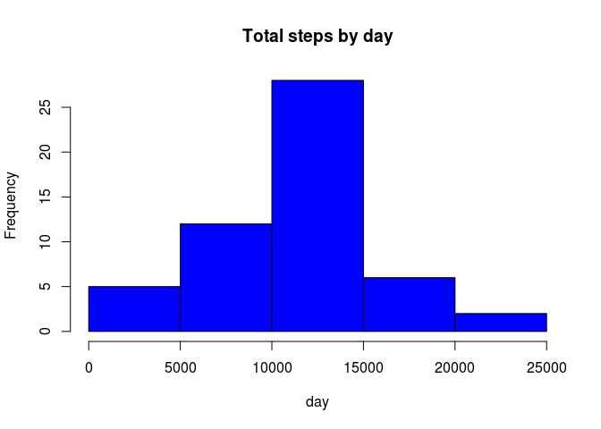
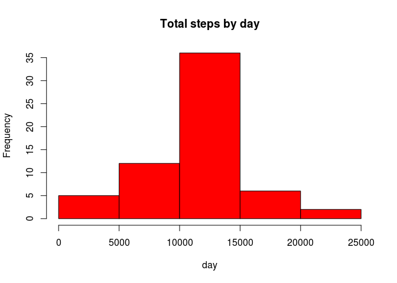
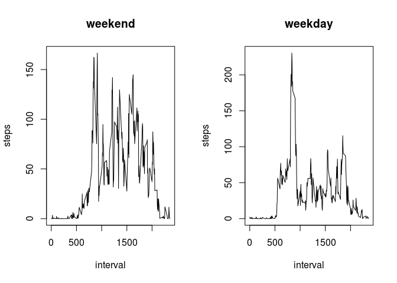

# Reproducible Research: Peer Assessment 1


## Loading and preprocessing the data

```r
source("/home/henrique/Cousera/Reproducible Research/set.R")
```

```
## Loading required package: ggplot2
## Loading required package: lubridate
## Loading required package: dplyr
## 
## Attaching package: 'dplyr'
## 
## The following objects are masked from 'package:lubridate':
## 
##     intersect, setdiff, union
## 
## The following object is masked from 'package:stats':
## 
##     filter
## 
## The following objects are masked from 'package:base':
## 
##     intersect, setdiff, setequal, union
## 
## 
## Attaching package: 'data.table'
## 
## The following objects are masked from 'package:dplyr':
## 
##     between, last
## 
## The following objects are masked from 'package:lubridate':
## 
##     hour, mday, month, quarter, wday, week, yday, year
```

```r
file.src  <- "https://d396qusza40orc.cloudfront.net/repdata%2Fdata%2Factivity.zip"
file.name <- basename(file.src)
file.dst  <- paste(workspace,"Assessment","01-Assessment","01-Data","repdata%2Fdata%2Factivity.zip",sep = "/")
dataset.raw     <- read.csv(file = paste(dirname(file.dst),"activity.csv",sep="/"))
dataset.raw$date<- as.Date(dataset.raw$date)
```


## What is mean total number of steps taken per day?


1. Make a histogram of the total number of steps taken each day


```r
step.total <- aggregate(steps ~ date, data = dataset.raw, sum, na.rm = TRUE)
hist(step.total$steps, main = "Total steps by day", xlab = "day", col = "blue")
```

 

2. Calculate and report the **mean** and **median** total number of steps taken per day


```r
mean(step.total$steps)
```

```
## [1] 10766.19
```

```r
median(step.total$steps)
```

```
## [1] 10765
```

## What is the average daily activity pattern?
1. Make a time series plot (i.e. `type = "l"`) of the 5-minute interval (x-axis) and the average number of steps taken, averaged across all days (y-axis)

```r
step.interval <- aggregate(steps ~ interval, data = dataset.raw, FUN = mean)
plot(step.interval, type = "l")
```

 

2. Which 5-minute interval, on average across all the days in the dataset, contains the maximum number of steps?

```r
step.interval$interval[which.max(step.interval$steps)]
```

```
## [1] 835
```


## Imputing missing values
1. Calculate and report the total number of missing values in the dataset (i.e. the total number of rows with `NA`s)

```r
sum(is.na(dataset.raw))
```

```
## [1] 2304
```

2. Devise a strategy for filling in all of the missing values in the dataset. The strategy does not need to be sophisticated. For example, you could use the mean/median for that day, or the mean for that 5-minute interval, etc.


```r
fillNA <- numeric()
for (i in 1:nrow(dataset.raw)) {
  obs <- dataset.raw[i, ]
  if (is.na(obs$steps)) {
    steps <- subset(step.interval, interval == obs$interval)$steps
  } else {
    steps <- obs$steps
  }
  fillNA <- c(fillNA, steps)
}

dataset.complete <- dataset.raw
dataset.complete$steps <- fillNA

step.total.complete <- aggregate(steps ~ date, data = dataset.complete, sum, na.rm = TRUE)
```
4. Make a histogram of the total number of steps taken each day and Calculate and report the **mean** and **median** total number of steps taken per day. Do these values differ from the estimates from the first part of the assignment? What is the impact of imputing missing data on the estimates of the total daily number of steps?


```r
hist(step.total.complete$steps, main = "Total steps by day", xlab = "day", col = "red")
```

 

```r
mean(step.total.complete$steps)
```

```
## [1] 10766.19
```

```r
median(step.total.complete$steps)
```

```
## [1] 10766.19
```


## Are there differences in activity patterns between weekdays and weekends?


```r
daytype <- function(date) {
  if (weekdays(as.Date(date)) %in% c("Saturday", "Sunday")) {
    "weekend"
  } else {
    "weekday"
  }
}
dataset.complete$daytype <- as.factor(sapply(dataset.complete$date, daytype))

par(mfrow = c(1, 2))
for (type in c("weekend", "weekday")) {
  step.type <- aggregate(steps ~ interval, data = dataset.complete, subset = dataset.complete$daytype == 
                            type, FUN = mean)
  plot(step.type, type = "l", main = type)
}
```

 
